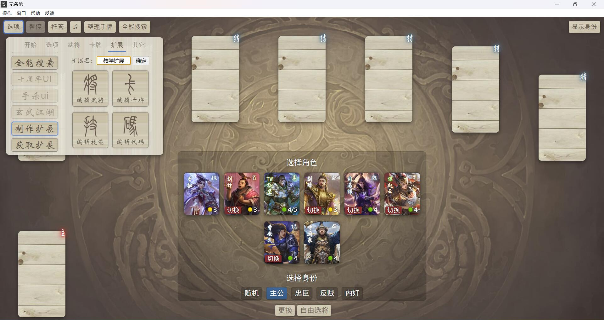
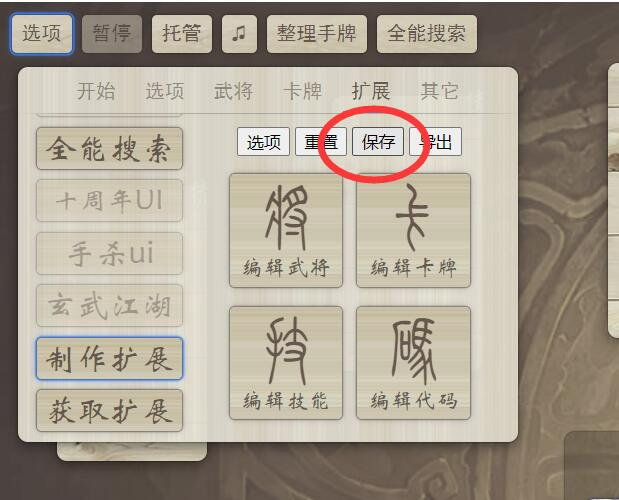
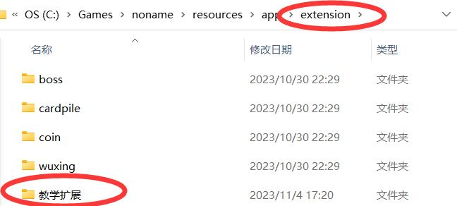
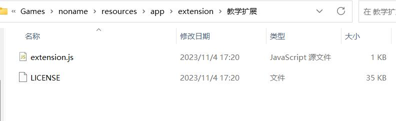

#你好，无名杀

>千里之行，始于足下。——《道德经》

很多编程语言或者框架的使用教程中，第一个案例就是编写一个"hello world"程序。这里，我们便萧规曹随。先一步一步写一个示范程序，设计这样一个技能。它的效果只有一个：让我的武将说出[^说出]“你好，无名杀”。
[^说出]:这里的“说出”实际上就是显示一个对话框，不然你以为是直接合成语音吗，不会一上来就给你整这种狠活的，放心好了。

##准备工作

###软件环境
####无名杀

这是废话。

####文本编辑工具
如果你在电脑上开发，建议使用[Visual Studio Code](https://code.visualstudio.com/)。本教程的范例也均使用此工具。如果你不知道怎么在电脑上使用这个工具，并且强烈希望我教你，请点击[这里](http://baidu.physton.com/?q=%E5%A6%82%E4%BD%95%E4%B8%8B%E8%BD%BD%E5%B9%B6%E5%AE%89%E8%A3%85Visual%20Studio%20Code)。

如果你在手机上开发，建议使用**ES文件浏览器**，在各个应用市场均有下载。

游戏里自带一个代码编辑工具，但是我很不推荐使用。它只会带来更多的问题，这里也不会提供任何关于它的教程，除非有一位不嫌麻烦的人帮我写。

##创建扩展

首先，我们在游戏内创建一个空白的扩展。点击【选项】-【扩展】-【制作扩展】，输入一个扩展名（这里就叫《教学扩展》吧），然后点击确定。如图所示。





然后，我们进入无名杀安装目录下extension文件夹，看，一个名叫“教学扩展”的文件夹已经被创建在那里了。



打开这个文件夹，我们会看到两个文件。extension.js和LICENSE文件。



LICENSE文件是GPL协议[^GPL]的证书文件。而extension.js就是扩展的主代码文件。让我们打开这个文件，进行下一步的操作吧。
[^GPL]:关于GPL协议的相关说明，可以自行去查阅了解相关资料。这里只要知道，无名杀的扩展都有按照GPL协议发布的义务即可，可参考[GPLv3协议中文译文](https://zhuanlan.zhihu.com/p/608456168)。

##扩展代码结构

```JavaScript
game.import("extension",function(lib,game,ui,get,ai,_status){return {name:"教学扩展",content:function(config,pack){
    
},precontent:function(){
    
},config:{},help:{},package:{
    character:{
        character:{
        },
        translate:{
        },
    },
    card:{
        card:{
        },
        translate:{
        },
        list:[],
    },
    skill:{
        skill:{
        },
        translate:{
        },
    },
    intro:"",
    author:"无名玩家",
    diskURL:"",
    forumURL:"",
    version:"1.0",
},files:{"character":[],"card":[],"skill":[],"audio":[]}}})
```