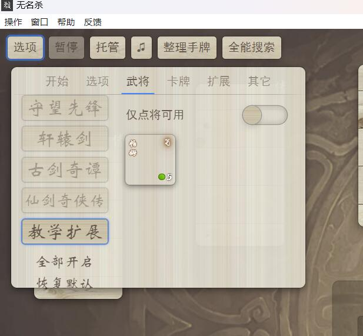
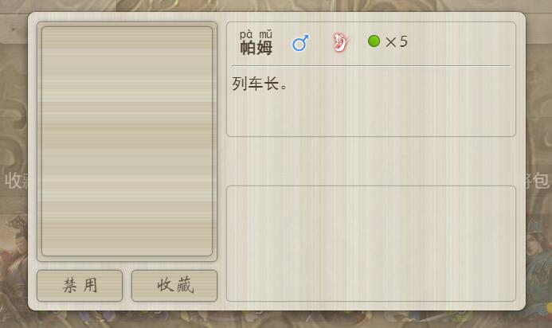
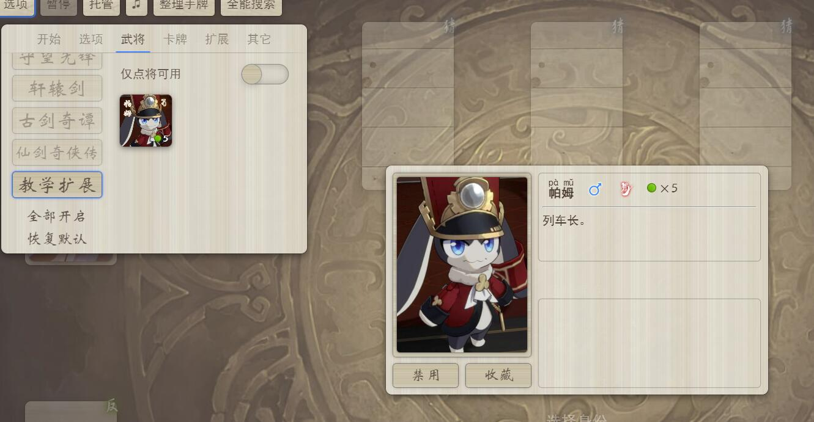
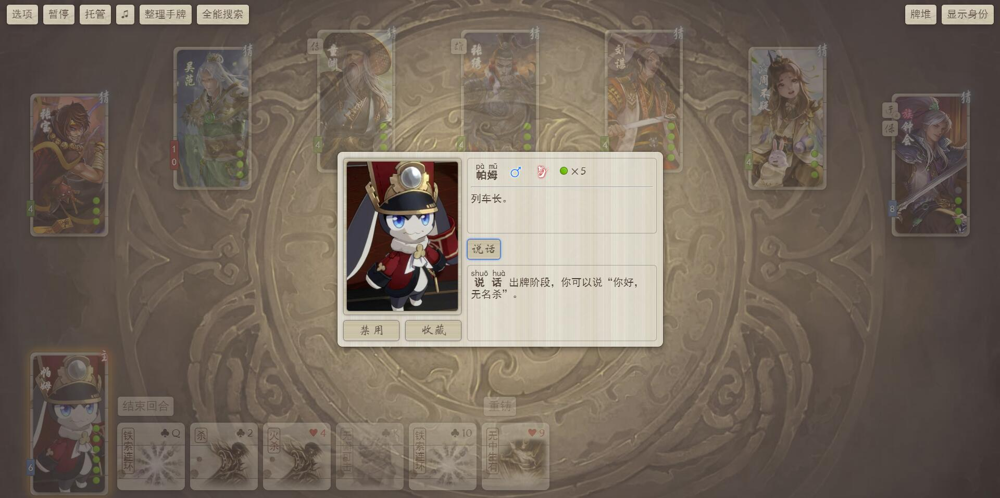
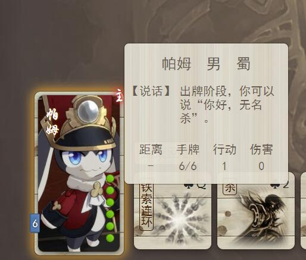
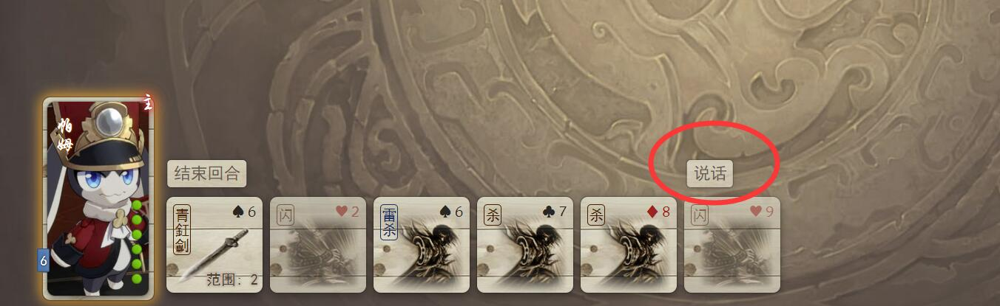
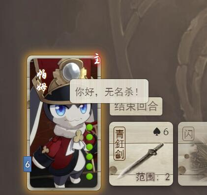
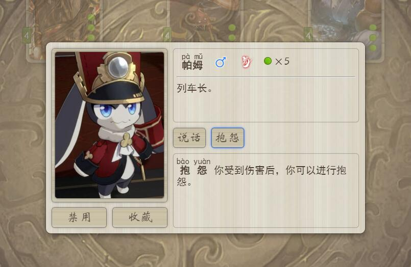
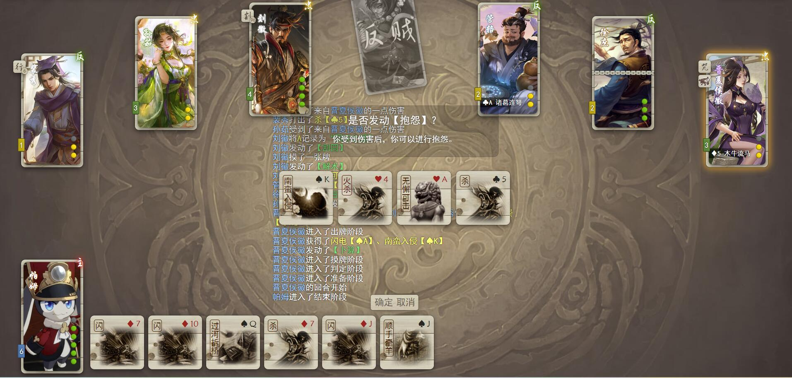
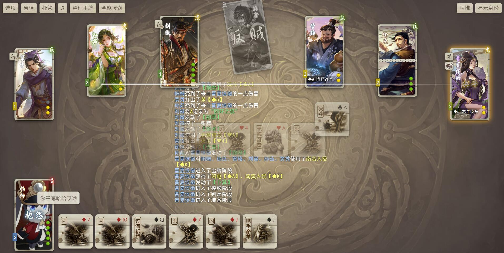

# 你好，无名杀

> 千里之行，始于足下。——《道德经》

很多编程语言或者框架的使用教程中，第一个案例就是编写一个"hello world"程序。这里，我们便萧规曹随[^萧规曹随]。先一步一步写一个示范程序，设计这样一个技能。它的效果只有一个：让我的武将说出[^说出]“你好，无名杀”。

[^说出]:这里的“说出”实际上就是显示一个对话框，不然你以为是直接合成语音吗，不会一上来就给你整这种狠活的，放心好了。

[^萧规曹随]:萧规曹随指萧何创立了规章制度，死后，曹参做了宰相，仍照着实行。比喻完全按照前人的成规办事。

**请注意**，也许你有很多自己的想法，但是在对本篇章的实践中，你**最好**熟练的复制粘贴。在你没有理解JavaScript的效果前，你对任何一个标点符号的**遗漏**、**修改**都可能导致未知的效果。而作者根本没空帮你检查你究竟改了哪个标点符号。

## 准备工作

### 软件环境
#### 无名杀

这是废话。

#### 文本编辑工具
如果你在电脑上开发，建议使用[Visual Studio Code](https://code.visualstudio.com/)。本教程的范例也均使用此工具。如果你不知道怎么在电脑上使用这个工具，并且强烈希望我教你，请点击[这里](http://baidu.physton.com/?q=%E5%A6%82%E4%BD%95%E4%B8%8B%E8%BD%BD%E5%B9%B6%E5%AE%89%E8%A3%85Visual%20Studio%20Code)。

如果你在手机上开发，建议使用**ES文件浏览器**，在各个应用市场均有下载。

游戏里自带一个代码编辑工具，但是我很不推荐使用。它只会带来更多的问题，这里也不会提供任何关于它的教程，除非有一位不嫌麻烦的人帮我写。

## 创建扩展

首先，我们在游戏内创建一个空白的扩展。点击【选项】-【扩展】-【制作扩展】，输入一个扩展名（这里就叫《教学扩展》吧），然后点击“确定”，之后点击“保存”。如图所示。


然后，我们进入无名杀安装目录下extension文件夹，看，一个名叫“教学扩展”的文件夹已经被创建在那里了。


打开这个文件夹，我们会看到两个文件。extension.js和LICENSE文件。


LICENSE文件是GPL协议[^GPL]的证书文件。而extension.js就是扩展的主代码文件。让我们打开这个文件，进行下一步的操作吧。

[^GPL]:关于GPL协议的相关说明，可以自行去查阅了解相关资料。这里只要知道，无名杀的扩展都有按照GPL协议发布的义务即可，可参考[GPLv3协议中文译文](https://zhuanlan.zhihu.com/p/608456168)。

## 扩展代码结构

打开文件后，我们可以看到以下代码。

```JavaScript
game.import("extension",function(lib,game,ui,get,ai,_status){return {name:"教学扩展",content:function(config,pack){
    
},precontent:function(){
    
},config:{},help:{},package:{
    character:{
        character:{
        },
        translate:{
        },
    },
    card:{
        card:{
        },
        translate:{
        },
        list:[],
    },
    skill:{
        skill:{
        },
        translate:{
        },
    },
    intro:"",
    author:"无名玩家",
    diskURL:"",
    forumURL:"",
    version:"1.0",
},files:{"character":[],"card":[],"skill":[],"audio":[]}}})
```

下面，笔者将给这段代码加上注释[^注释]，来说明这段代码里各个模块的作用。如果你仍然不了解里面各部分的作用，也不必着急，这里仅仅是一个概述。当前我们并不需要知道那么多。随着教学的深入，我们会逐渐接触到这些内容。

[^注释]:在JavaScript代码中，以两个斜杠（//）开头的一行文本，或者被/* */包裹的文本被称为“注释”，注释仅为方便阅读代码而写，不会被执行。

```JavaScript
game.import("extension",function(lib,game,ui,get,ai,_status){return {name:"教学扩展",content:function(config,pack){
    //content函数，扩展的主代码。扩展执行会加载这个代码，在对局启动前会调用这段代码。
},precontent:function(){
    //preconent函数，扩展的启动代码。游戏启动时会加载此段代码。
},config:{},help:{},package:{
    character:{
        character:{//此处是角色列表。
        },
        translate:{//此处是角色ID的翻译。
        },
    },
    card:{
        card:{//此处是卡牌列表。
        },
        translate:{//此处是卡牌ID的翻译。
        },
        list:[],//牌堆构筑。
    },
    skill:{
        skill:{//此处是技能列表。
        },
        translate:{//此处是技能ID的翻译。
        },
    },
    intro:"",//可以填入此扩展的介绍。
    author:"无名玩家",//可以填入作者。
    diskURL:"",//网盘链接。
    forumURL:"",//论坛链接。
    version:"1.0",//扩展版本号。
},files:{"character":[],"card":[],"skill":[],"audio":[]/**暂时无用的特性，不用了解，保持原样即可。 */}}})
```

## 添加角色

下面我们开始在这个扩展里添加一个角色【帕姆】。

首先，我们需要在character块中加入一些信息：

```JavaScript
    character:{
        character:{
            'jxkz_pamu':['male','shu',5,[],['des:列车长。']],
        },
        translate:{
            'jxkz_pamu':'帕姆',
        },
    },
```

保存文件并打开游戏，我们发现，一个新武将出现了！





我们填入的，就是这个武将的基础信息。包含以下部分：

* **角色ID：**
```'jxkz_pamu'```是这个角色的唯一标识ID。ID类似于身份证号，对每个角色而言都是唯一的。为了避免和别的扩展撞车，我们最好给自己扩展的角色ID安排统一的前缀，比如这里就用```jxkz_```作为前缀。如果你不想在日后处理铺天盖地的乱码问题，请保证你的武将ID里仅包含英文字母与下划线。

* **角色性别：**
```male```是我们添加的这个角色“帕姆”的性别。男性为male，女性为female，双性别为double（即同时会被判定为男性和女性），你也可以任意填写你需要的性别，但目前的代码逻辑不会识别之外的性别。

* **势力：**
```shu```是该角色的势力。“魏”、“蜀”、“吴”、“群”、“晋”分别为wei、shu、wu、qun、jin。

* **血量：**
```5```是该角色的血量。你可以填入任意数字，也可以填入类似这样的字符串"5/6"，来表示这个角色有五血六上限。也可以用字符串"5/6/2"表示此角色有五血六上限且开局自带两个护盾。

* **技能列表：**
相信你注意到了，目前```['male','shu',5,[],['des:列车长。']]```中有一个```[]```，这个是技能的列表，目前空置是因为没有技能，后面我们会往里面填技能ID的。

* **额外信息：**
```['des:列车长。']```是该角色一些额外的信息。```des:```开头的部分为此角色的介绍。你可以在这个列表里塞入```'zhu'```来表示这个角色是主公角色。就像这样：```['zhu','des:列车长。']```

* **ID翻译：**
```translate```下面的部分是此角色ID的翻译，游戏内此角色的中文显示名。

然后，虽然这个操作不是很有必要，但是为了让你不至于觉得太过枯燥，我们来给这个武将安排一张图片吧。


将这张图片命名为```jxkz_pamu.jpg```并放置在```extension/教学扩展```文件夹下。重新启动游戏，我们的角色就有图了。



恭喜你，这是你制作的第一个武将。虽然他只是个没有任何技能的白板，但是单挑已经完胜刘皇叔和步练师了，不是吗？

## 添加技能

下面我们来给这个角色“帕姆”添加一个小技能。

在```skill```块中，对代码进行如下修改：

```JavaScript
    skill:{
        skill:{
            'jxkz_shuohua':{

            },
        },
        translate:{
            'jxkz_shuohua':'说话',
            'jxkz_shuohua_info':'出牌阶段，你可以说“你好，无名杀”。',
        },
    },
```

现在我们在技能库里添加了一个空技能。技能ID为```jxkz_shuohua```，技能中文名为“说话”。在```translate```块中，我们可以加入这个技能的中文命名和技能描述，“技能ID_info”对应的项即为该技能的描述。

现在这个技能仅在技能库中，还没有加给角色。让我们把这个技能加给角色吧。

修改```character```块：

```JavaScript
    character:{
        character:{
            'jxkz_pamu':['male','shu',5,['jxkz_shuohua'],['des:列车长。']],
        },
        translate:{
            'jxkz_pamu':'帕姆',
        },
    },
```

如此，我们就把技能```jxkz_shuohua```添加到了角色“帕姆”身上。让我们看看在游戏里的效果吧。





现在这个技能是空的，没有任何效果。我们来给它添加一个简单的效果。

修改```skill```块中的技能块：

```JavaScript
        skill:{
            'jxkz_shuohua':{
                enable:'phaseUse',
                content:function(){
                    player.say("你好，无名杀！");
                }
            },
        },
```

进入游戏，自由选将选择“帕姆”开局，我们看到，角色已经多了一个技能按钮：



点击这个按钮，我们就可以看到实现完成的效果了。



如此，我们成功实现了一个没什么用的技能。

```enable:'phaseUse'```表示这个技能是在**出牌阶段**主动发动的技能。而```content```下面这一串，是技能实现的效果代码。

让我们再给这个角色添加另外一个可以通过受到伤害触发的技能吧。

修改```skill```块与```character```块。

```JavaScript
    skill:{
        skill:{
            'jxkz_shuohua':{
                enable:'phaseUse',
                content:function(){
                    player.say("你好，无名杀！");
                }
            },
            'jxkz_baoyuan':{
                trigger:{
                    player:'damageEnd',
                },
                content:function(){
                    player.say('你干嘛哈哈哎呦');
                }
            }
        },
        translate:{
            'jxkz_shuohua':'说话',
            'jxkz_shuohua_info':'出牌阶段，你可以说“你好，无名杀”。',
            'jxkz_baoyuan':'抱怨',
            'jxkz_baoyuan_info':'你受到伤害后，你可以进行抱怨。',
        },
    },
```

```JavaScript
    character:{
        character:{
            'jxkz_pamu':['male','shu',5,['jxkz_shuohua','jxkz_baoyuan'],['des:列车长。']],
        },
        translate:{
            'jxkz_pamu':'帕姆',
        },
    },
```

保存文件后重启游戏，我们发现“帕姆”又多了一个技能：



开始游戏，等到帕姆受到伤害。



受到伤害后，弹出提示询问是否发动技能，选择发动：



成功执行此技能的效果。

## 结语

如此，你已经在手把手的教学下，成功制作了一个单将扩展。是不是已经准备摩拳擦掌挑战更加复杂的技能了？

做梦呢！

接下来，你将面对对于萌新而言相当于噩梦的JavaScript语法篇章。如果你有C++、Java、JavaScript等语言的编程基础，后面的篇章与你而言很好理解。但如果你是个对代码一窍不通的新手中的新手，那下一章于你而言是重中之重。如果你不能理解下一章，我建议放弃开发技能代码，好好玩别人写的，不香吗？

当然，也不用被我吓到。其实JavaScript的语法十分简单。然而很多人骨子里的懒惰和好高骛远，导致他们经常跳过这一基础部分，而去直接追求高大上的技能。于是，他们经常在无名杀相关的代码群里询问一些不知所然且愚蠢至极的问题，愚蠢到他们自己都意识不到问题该怎么问。答应我，不要做这样的人。

本章的[范例代码](教学扩展/extension.js)在此文件夹内，可自行查阅。